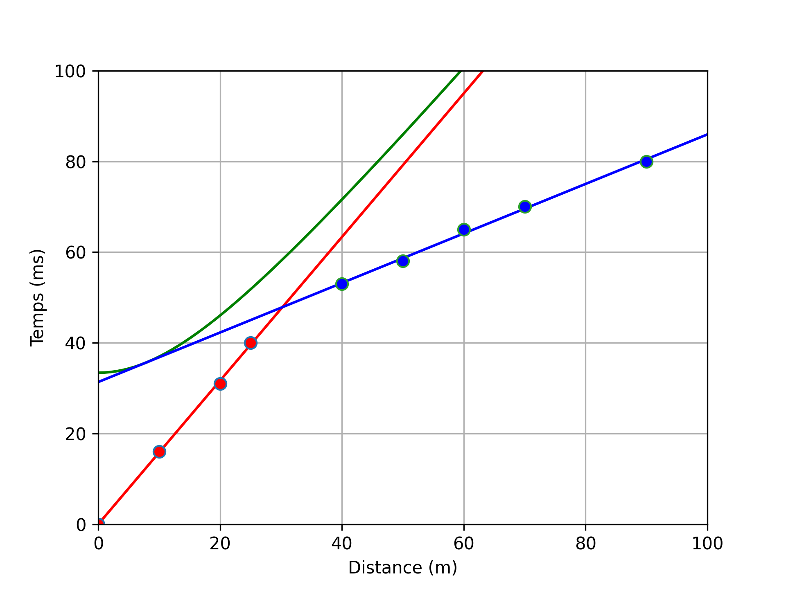

# Programme de tracé d'hodochrones et de modélisation de la structure du sous-sol par sismique réfraction

Ce programme Python permet de tracer des hodochrones d'ondes sismiques et de modéliser la structure du sous-sol en fonction des données d'entrée.

## Objectifs pédagogiques

Ce programme peut être utilisé à des fins éducatives pour enseigner la
méthode sismique dromochronique de sismique réfraction qui
permet d'analyser les temps d'arrivées des ondes directes
et des ondes réfractées critiques.

La version actuelle ne s'applique qu'au modèle à deux couches horizontales
séparées par un réflecteur plan et horizontal.
La surface du sol est plane et horizontale aussi.

Le code permet de calculer les vitesses de propagation de l'onde dans les deux couches,
ainsi que de calculer la profondeur h du réflecteur.

Le programme calcule les hodochrones théoriques des ondes directes, réfléchies et réfractées critiques.

## Prérequis

- Python 3.x
- Les bibliothèques suivantes : numpy, matplotlib

## Installation

1. Clonez le dépôt Git :

`git clone <https://github.com/regthiery/SeismicHodochrones.git>`
2. Installez les dépendances :

`pip install -r requirements.txt`

## Utilisation

01. Écrivez votre propre script ou utilisez l'un des scripts fournis dans le dossier `scripts/`.
02. Exécutez le programme :

`python3 SeismicHodochrones.py nom_du_script``
03. Les résultats de la modélisation seront enregistrés dans le dossier `images/`.

## Demonstration

Image de démonstration produite par le programme: hodochrones des ondes directe, réfléchie et conique.

Consulter aussi <https://youtu.be/2x7rniZIDFE>

## Auteurs

- Régis Thiéry (regthiery@mail.com)

## Licence

Ce programme est sous licence MIT. Veuillez consulter le fichier `LICENSE` pour plus d'informations.
